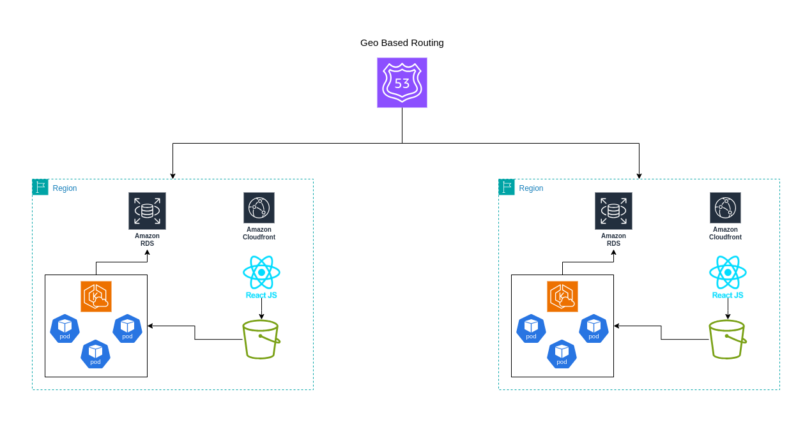

# High-Level Architecture

The KnowledgeCity platform is designed to be a cloud-native, multi-regional, and highly available system capable of serving users from different parts of the world with low latency and strong regional compliance.

## Core Principles

- **Multi-Regional Deployment**: U.S. and Saudi Arabia are used as primary regions.
- **High Availability**: Each region spans multiple availability zones to ensure 99.99% uptime.
- **Separation of Concerns**: Frontend, monolith, microservices, and data pipelines are clearly separated.
- **Data Residency**: User data is stored in the region of origin (Saudi for Saudi users, U.S. for U.S. users).

## Architecture Components

- **Frontend**: Deployed via Amazon S3 and served globally using Amazon CloudFront.
- **Backend (Monolith)**: A PHP application hosted in Amazon EKS, handling core logic.
- **Microservices**: Analytics, video conversion, and other domain-specific services in EKS.
- **Storage**: Amazon S3 with cross-region replication and intelligent tiering.
- **Databases**: ClickHouse for analytics, RDS for structured app data.
- **Event Bus**: Amazon EventBridge used for decoupled, event-driven architecture.
- **Global CDN**: Ensures fast delivery of video and frontend assets.

## Reliability and Redundancy

- **Multi-AZ** within each region.
- Cross-region S3 replication for educational content.
- Stateless services running behind load balancers.

---

[⬅ Back to Home](index.md)

