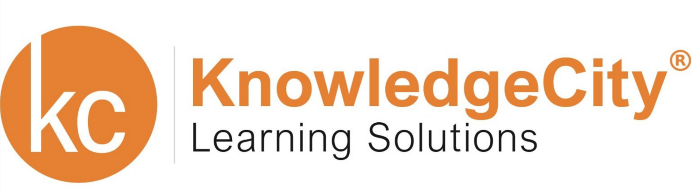

# KnowledgeCity Platform Architecture

Welcome to the documentation for the KnowledgeCity multi-regional, scalable, and highly available cloud-native platform architecture.

## Contents

- [High-Level Architecture](architecture.md)
- [Frontend Design](frontend.md)
- [PHP Monolith Application](php-monolith.md)
- [Analytics Microservice (ClickHouse)](analytics.md)
- [Video Processing and Delivery](video-processing.md)
- [Data Distribution & Multi-Regional Setup](multi-regional.md)
- [Scalability and Optimization](scalability.md)
- [Security and Compliance](security.md)
- [Observability & Monitoring](observability.md)
- [Extensibility & Future Microservices](future-microservices.md)

---

For a visual walkthrough of the architecture, refer to the [Architecture Overview](architecture.md).

